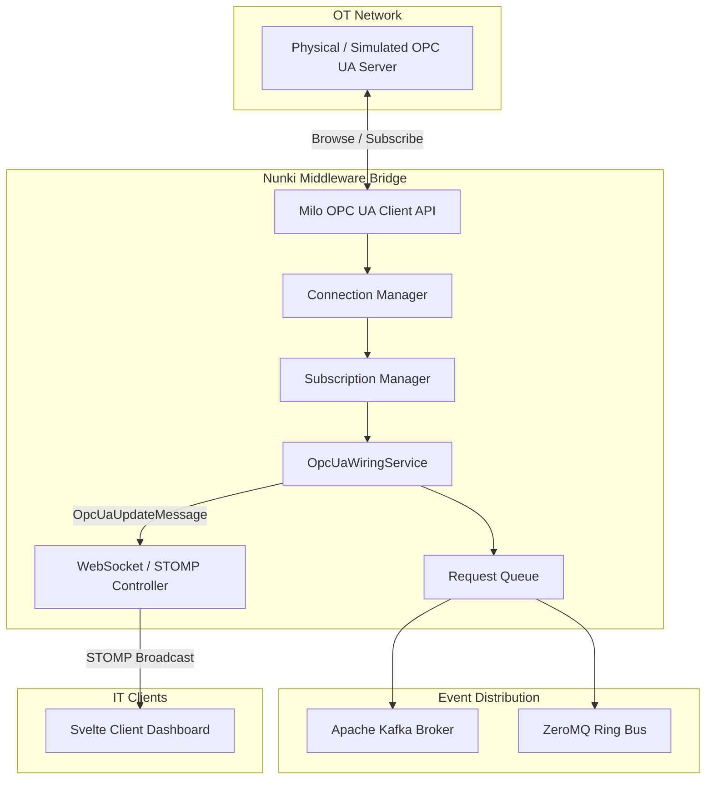

# 🌌 Nunki Project

Nunki is a high-performance, industrial-grade middleware bridge designed to connect operational technology (OT) with modern information technology (IT) networks. Built on Spring Boot 3.2.5 and the Eclipse Milo OPC UA stack, Nunki automates tree browsing and real-time subscription management for OPC UA telemetry, streaming variables to clients via secure WebSockets (STOMP) and publishing events to message brokers (Apache Kafka & ZeroMQ).

---

## 🎯 Goal

The primary goal of Nunki is to act as a resilient, low-latency telemetry gateway. It bridges the gap between field-level industrial devices (sensors, PLCs, motors) and cloud-level analytics by parsing complex OPC UA node trees, managing connections and subscriptions defensively, and routing updates to multiple endpoints with minimum overhead.

---

## 🏗️ Architecture & Data Flow

Nunki employs a highly structured architecture linking the OPC UA fieldbus to event distribution rings:



---

## ✨ Key Capabilities

1. **🌳 Dynamic OPC UA Tree Discovery**: Automatically connects to specified endpoints, crawls the hierarchical `ObjectsFolder` recursively, maps native data types (DataTypeMapper), and registers variables without manual address mapping.
2. **🔌 Defensive Connection Management**: Incorporates automatic reconnection policies, heartbeat monitoring, and transaction queuing to buffer data during network drops.
3. **⚡ STOMP WebSocket Broadcasting**: Utilizes a broker-backed WebSocket channel to stream live tag updates to subscribed client dashboards.
4. **🔄 Multi-Broker Event Bus**: Bridges telemetry updates to Apache Kafka topics and ZeroMQ sockets to satisfy both store-and-forward and low-overhead pub/sub distribution patterns.
5. **🎨 Embedded Svelte Dashboard**: Features an integrated Svelte-based monitoring console built and bundled inside the Spring Boot jar at package time.

---

## 📋 Requirements

* **Java Development Kit (JDK)**: Version 17
* **Build System**: Apache Maven 3.8.0 or later
* **Node.js**: Version 22.12.0 (managed automatically by Maven during build)
* **Databases & Message Brokers (Optional for Dev)**:
  * MongoDB (Telemetry storage)
  * Apache Kafka (Event pipeline)

---

## 📦 Core Dependencies

The project defines its dependencies inside `pom.xml`. Major libraries include:

* **Eclipse Milo (`0.6.11`)**: SDK client/server library for OPC UA compliance.
* **Spring Boot Starter Web & Security**: Exposes REST interfaces and secures endpoints.
* **Spring Boot Starter Data MongoDB**: Standard ODM for logging telemetry to MongoDB.
* **Spring Kafka**: Native Kafka consumer/producer bindings.
* **Jeromq (`0.5.3`)**: Pure Java ZeroMQ implementation.
* **Svelte & Vite** (Frontend): Located under `src/main/frontend/`.

---

## 📂 Repository Structure

```
.
├── pom.xml                     # Maven project specification
├── Dockerfile                  # Container definition for Nunki bridge
├── doc/                        # Documentation configuration (MkDocs)
├── helpers/                    # CI/CD and deployment helper scripts
└── src/
    └── main/
        ├── frontend/           # Svelte dashboard source files (Vite-based)
        ├── java/
        │   └── com/example/nunki/
        │       ├── config/     # Spring Security and WebSockets configuration
        │       ├── controller/ # REST Controllers (OPC UA trigger endpoints, heartbeat pings)
        │       ├── opcua/      # Eclipse Milo OPC UA logic
        │       │   ├── api/    # Client API interface definitions
        │       │   ├── service/# Connection, subscription, and wiring services
        │       │   └── dto/    # Data transfer models
        │       └── runner/     # CLI entry point runner
        └── resources/          # Spring application properties and static assets
```

---

## ⚙️ Build and Installation

Nunki utilizes the `frontend-maven-plugin` to coordinate Node.js installs and frontend compilation directly into the Maven build lifecycle.

### Build and Package
To clean, compile, run tests, and package both the C++ virtual assets and Java deliverables:
```bash
mvn clean package
```
This builds the Svelte frontend, bundles the static assets in `target/classes/static/`, and packages a runnable fat JAR at `target/nunki-0.0.1-SNAPSHOT.jar`.

### Execution
Run the packaged application:
```bash
java -jar target/nunki-0.0.1-SNAPSHOT.jar
```

To run in CLI administration mode for scripting, pass `cli` as the first argument:
```bash
java -jar target/nunki-0.0.1-SNAPSHOT.jar cli
```
