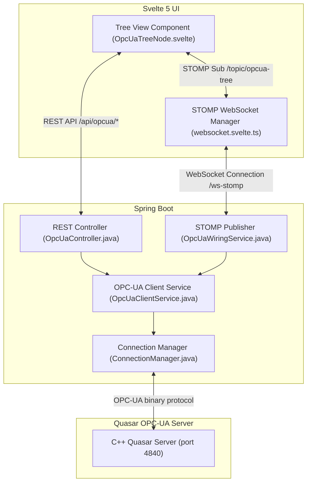

# OPC-UA Full-Stack Integration Architecture

This document describes the design, implementation, and verification plan for the integration between the **C++ Quasar OPC UA Server**, the **Java Spring Boot Backend (OPC UA Client & WebSocket Broker)**, and the **Svelte 5 Frontend**.

---

## 1. System Topology

---

## 2. Sequence Workflow

### A. Initialization & Real-Time Monitoring
1. On **Startup**, the Spring Boot backend (`OpcUaWiringService`) establishes an OPC-UA connection to the Quasar Server.
2. The backend recursively browses the OPC-UA address space starting from `ns=1;s=Data` and obtains the tree structure.
3. For every **Variable** node encountered (such as `MySwitch`), the backend registers a subscription monitor.
4. When a variable's value changes on the OPC-UA server, the change triggers the subscription callback. The backend serializes the change to an `OpcUaUpdateMessage` and broadcasts it to `/topic/opcua-tree` via STOMP.
5. Svelte 5 frontend component (`OpcUaTreeNode.svelte`) listens to the STOMP updates reactively via `$derived(wsManager.opcUaUpdates)` and updates the displayed value in real time.

### B. Write Operations
1. The user inputs a new value in `OpcUaTreeNode.svelte` and clicks **Save**.
2. The frontend invokes `wsManager.writeOpcUaValue()`, executing a `POST` request to `/api/opcua/write`.
3. The REST controller parses the value type (e.g. `Boolean`, `Integer`, `Double`, `String`) and converts it to a Milo `Variant`.
4. The backend writes the new value to the OPC-UA server.
5. The write triggers the OPC-UA server state change, which automatically propagates back to the frontend via the subscription channel.

### C. Method Invocation
1. The user clicks **Invoke** on a Method node (such as `ToggleSwitch()`) in `OpcUaTreeNode.svelte`.
2. The frontend invokes `wsManager.invokeOpcUaMethod()`, sending a `POST` request to `/api/opcua/invoke`.
3. The backend executes `opcUaClient.call(...)` with the method's parent object ID and method ID.
4. The C++ server runs the method logic (e.g., toggling `MySwitch` internally) and returns a result.
5. The REST controller sends the execution status and output back to the frontend.

---

## 3. Endpoints Specification

### REST Endpoints
* **`GET /api/opcua/tree`**
  * *Description*: Fetches the complete browsed OPC-UA node hierarchy starting from `ns=1;s=Data`.
  * *Response*: `OpcUaNodeDto` (JSON Tree).
* **`POST /api/opcua/write`**
  * *Description*: Writes a value to an OPC-UA Variable node.
  * *Request Body*: `OpcUaWriteRequest { nodeId: String, value: String, type: String }`
  * *Response*: `OpcUaWriteResponse { success: boolean, statusCode: long }`
* **`POST /api/opcua/invoke`**
  * *Description*: Invokes an OPC-UA Method node.
  * *Request Body*: `OpcUaInvokeRequest { objectId: String, methodId: String, arguments: List<String> }`
  * *Response*: `OpcUaInvokeResponse { success: boolean, result: String, statusCode: long }`

### WebSocket STOMP Channels
* **Subscription Destination**: `/topic/opcua-tree`
  * *Payload*: `OpcUaUpdateMessage { nodeId: String, value: String, timestamp: long }`

---

## 4. Verification & Testing

### Unit Tests
* **`OpcUaControllerTest.java`**: Uses Spring MockMvc and `@MockBean` to stub `OpcUaClientApi` behavior.
  * Asserts GET `/api/opcua/tree` returns valid JSON tree mappings.
  * Asserts POST `/api/opcua/write` converts types and returns status code.
  * Asserts POST `/api/opcua/invoke` triggers method calls and parses output arguments.

### E2E Integration Tests
* **`NavbarPlaywrightTest.java`**: Integrates Playwright E2E automation.
  * Asserts navigating to the "Values -> Tree view" dashboard.
  * Asserts recursive rendering of mocked folders (`Data`) and variables (`MySwitch`).

---

## 5. Architectural Quality Standards Compliance (CS-0020 / CS-0030)

1. **Precondition Rejections [CS-0030.1]**: Every DTO constructor and REST endpoint explicitly enforces null checks (`Objects.requireNonNull`) and parameter bounds.
2. **Null Safety [CS-0030.2]**: No endpoint or DTO method allows or propagates `null` values. Fallbacks return empty lists or empty strings.
3. **Explicit Typing [CS-0030.10]**: No usage of `var` type inference in Java backend code. Every type is statically and explicitly declared.
4. **Constructor Injection [CS-0030.13]**: Components use constructor-based dependency injection with immutable final fields.
5. **Traceability [CS-0030.15]**: All files contain header comments mapping them to the specific task and requirements.
