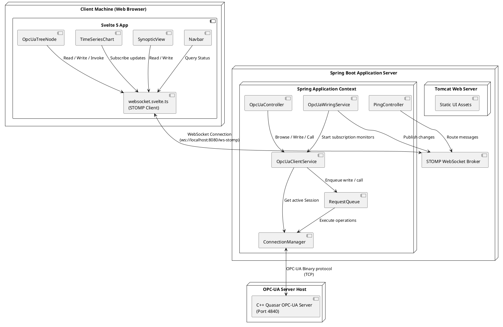
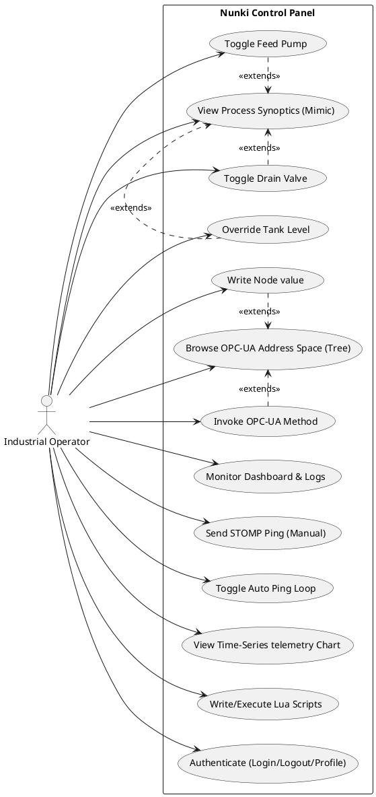
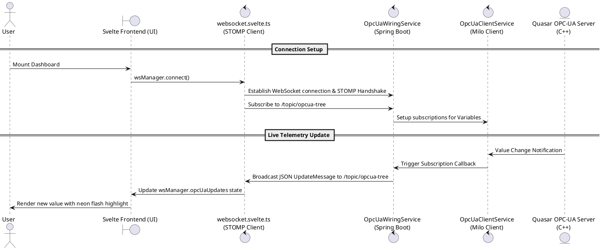
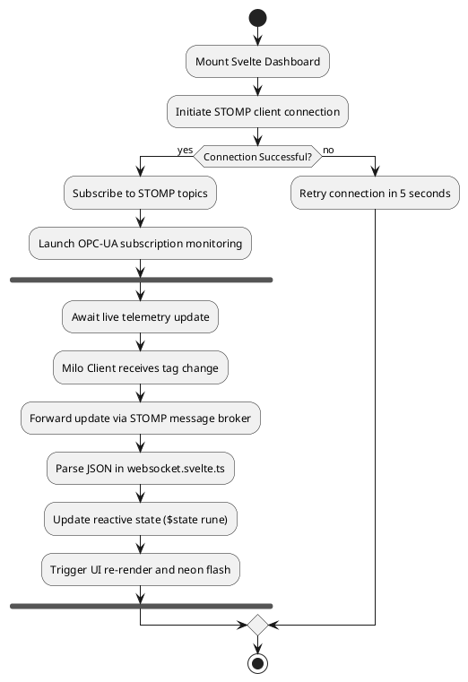
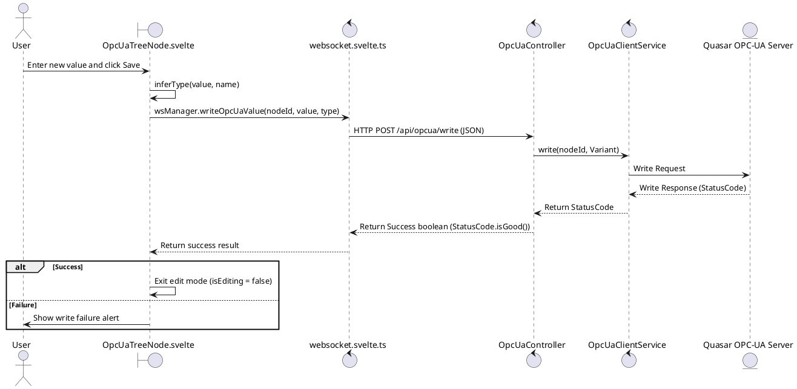
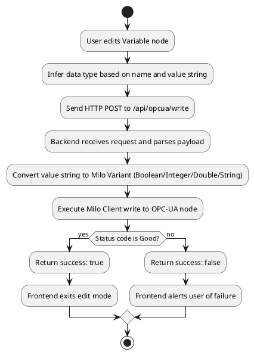
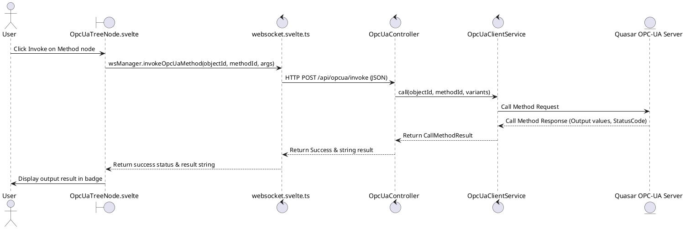
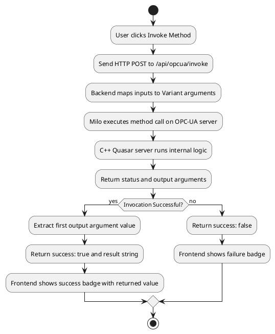
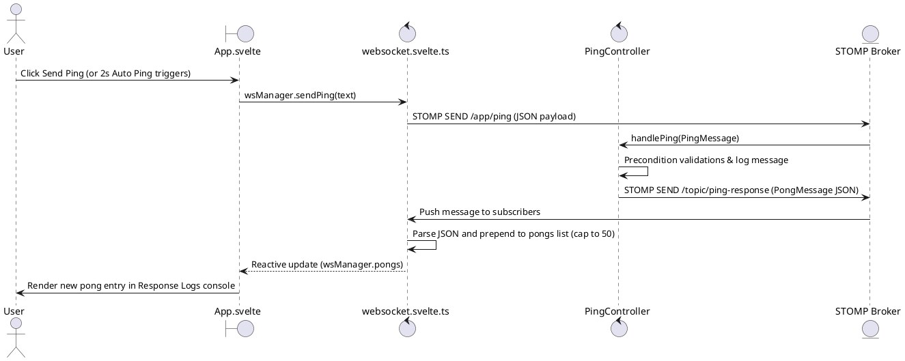
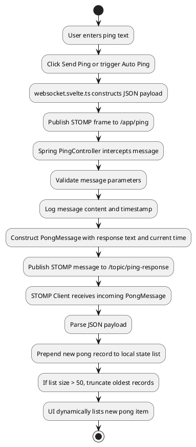

# Nunki Dashboard: Svelte 5 Frontend & Spring Boot Backend Architecture

This document provides a comprehensive architectural analysis and design reference for the **Nunki Control Panel**, a real-time industrial telemetry monitoring dashboard. It details the directory structure, components, state management using Svelte 5 Runes, and full-stack integration with the Spring Boot backend and the target OPC-UA Server.

---

## 1. Directory Structure & Layout Analysis

The Svelte frontend is situated in the directory `src/main/frontend`. The hierarchy of source files is organized as follows:

```
src/main/frontend/
├── index.html                     # Core HTML file containing root mount div#app
├── package.json                   # Project dependencies and build scripts
├── svelte.config.js               # Configuration settings for Svelte 5
├── tsconfig.json                  # Shared compiler configurations
├── vite.config.ts                 # Vite configuration setting up dev environment
└── src/
    ├── main.ts                    # Application bootstrapping entrypoint
    ├── app.css                    # Global styles, variables, light/dark themes
    ├── App.svelte                 # Main application shell & router
    └── lib/
        ├── Counter.svelte         # Basic counter template helper
        ├── Navbar.svelte          # Top navigation header dropdown bar
        ├── OpcUaTreeNode.svelte   # Collapsible recursive OPC-UA tree nodes
        ├── SynopticView.svelte    # SVG pipe fluid mimic diagram simulator
        ├── TimeSeriesChart.svelte # Native SVG line plot chart
        └── websocket.svelte.ts    # STOMP client manager and shared states
```

### Key Java Backend Architecture Files:
* [NunkiApplication.java](file:///home/vortigern/git/nunki/src/main/java/com/example/nunki/NunkiApplication.java): Main Spring Boot application entry point.
* [PingController.java](file:///home/vortigern/git/nunki/src/main/java/com/example/nunki/controller/PingController.java): Receives client websocket messages on `/app/ping` and replies to `/topic/ping-response`.
* [OpcUaController.java](file:///home/vortigern/git/nunki/src/main/java/com/example/nunki/controller/OpcUaController.java): Exposes REST HTTP API endpoints for browsing the address space, writing node values, and invoking method nodes.
* [OpcUaWiringService.java](file:///home/vortigern/git/nunki/src/main/java/com/example/nunki/opcua/service/OpcUaWiringService.java): Coordinates connections, browses tree on startup, registers subscription monitors on variable nodes, and forwards updates to `/topic/opcua-tree` via the STOMP template.
* [OpcUaClientService.java](file:///home/vortigern/git/nunki/src/main/java/com/example/nunki/opcua/service/OpcUaClientService.java): Wraps the Eclipse Milo OPC UA client implementation (browse, read, write, call).
* [ConnectionManager.java](file:///home/vortigern/git/nunki/src/main/java/com/example/nunki/opcua/connection/ConnectionManager.java): Configures and monitors connection handshakes.
* [SubscriptionManager.java](file:///home/vortigern/git/nunki/src/main/java/com/example/nunki/opcua/subscription/SubscriptionManager.java): Manages active Milo subscription monitors.
* [RequestQueue.java](file:///home/vortigern/git/nunki/src/main/java/com/example/nunki/opcua/queue/RequestQueue.java): Prevents race conditions by queuing concurrent write/call operations.

---

## 2. Component Design & Architectural Roles

### A. Bootstrapping Entry Point ([main.ts](file:///home/vortigern/git/nunki/src/main/frontend/src/main.ts))
* **Role**: Bootstraps Svelte 5.
* **Design & Logic**: Utilizes the modern `mount()` function of Svelte 5 to mount the root [App.svelte](file:///home/vortigern/git/nunki/src/main/frontend/src/App.svelte) component onto the HTML container (`#app`) using non-null assertion.

### B. Global Theme & Styling System ([app.css](file:///home/vortigern/git/nunki/src/main/frontend/src/app.css))
* **Role**: Visual design system definition.
* **Design & Logic**: Contains CSS variable tokens specifying color, typography, background gradients, and border-radius. Leverages `@media (prefers-color-scheme: dark)` to automate responsive dark-mode styling configurations.

### C. Application Router Shell ([App.svelte](file:///home/vortigern/git/nunki/src/main/frontend/src/App.svelte))
* **Role**: Main layout grid, reactive state shell, and page router.
* **Design & Logic**:
  * **Routing**: Evaluates `activeTab` to display the active view pane (`home`, `diagrams`, `timeseries`, `values-list`, `values-search`, `tree`, `automation-lua`).
  * **Networking Lifecycle**: Triggers `wsManager.connect()` inside `onMount` and disconnects sockets inside `onDestroy`.
  * **Modals Controller**: Manages modals (`login`, `logout`, `profile`) by modifying `userAction` state.

### D. WebSocket & STOMP Coordinator ([websocket.svelte.ts](file:///home/vortigern/git/nunki/src/main/frontend/src/lib/websocket.svelte.ts))
* **Role**: Full-stack async networking service.
* **Design & Logic**:
  * Encapsulates the `@stomp/stompjs` client connection to `ws://localhost:8080/ws-stomp` (dynamically compiled based on host port).
  * Exposes global reactive properties (`connected`, `pongs`, `opcUaUpdates`) to the rest of the application using Svelte 5 Runes.
  * Subscribes to STOMP destination channels:
    * `/topic/ping-response` - Caches and lists pongs, capping records at 50 logs.
    * `/topic/opcua-tree` - Map-updates incoming OPC-UA value shifts into the dictionary.
  * Provides async REST methods `writeOpcUaValue()` (POST to `/api/opcua/write`) and `invokeOpcUaMethod()` (POST to `/api/opcua/invoke`).

### E. Navigation dropdown Header ([Navbar.svelte](file:///home/vortigern/git/nunki/src/main/frontend/src/lib/Navbar.svelte))
* **Role**: Interactive Header navigation bar.
* **Design & Logic**:
  * Renders top header navigation controls with Lucide icons.
  * Registers a window event listener in `onMount` that intercepts window clicks. If a click target falls outside `.nav-item`, automatically collapses open dropdown submenus.

### F. Collapsible Hierarchical Node Navigator ([OpcUaTreeNode.svelte](file:///home/vortigern/git/nunki/src/main/frontend/src/lib/OpcUaTreeNode.svelte))
* **Role**: Recursive tree viewer for the OPC-UA address space.
* **Design & Logic**:
  * Recursively references itself for nested branches.
  * Translates node class states:
    * `Object` -> Collapsible directory.
    * `Variable` -> Renders live values, highlights updates, and offers inline value write triggers.
    * `Method` -> Lightning symbol invocation trigger and result display.
  * Triggers highlight flashes using an `$effect` block linked to shifts in the `liveValue` derived state.

### G. SVG Process Mimic Simulator ([SynopticView.svelte](file:///home/vortigern/git/nunki/src/main/frontend/src/lib/SynopticView.svelte))
* **Role**: Industrial human-machine interface (HMI).
* **Design & Logic**:
  * Renders inline SVGs of Storage Tank T-101, pipes, Feed Pump, and Drain Valve.
  * Connects an animation loop using `$effect` that shifts pipeline stroke dash offsets and rotates pump impeller blades when operational.
  * Binds Enter/Space keyboard event listeners to the valve graphical container for accessibility.

### H. SVG Telemetry Visualizer ([TimeSeriesChart.svelte](file:///home/vortigern/git/nunki/src/main/frontend/src/lib/TimeSeriesChart.svelte))
* **Role**: Real-time line chart plotting.
* **Design & Logic**:
  * Avoids heavy external charting libraries by scaling data points to pixel values within the SVG viewport using mathematical linear interpolation.
  * Dynamically re-scales axes by binding the container dimensions (`bind:clientWidth`, `bind:clientHeight`).

---

## 3. Svelte 5 Runes Reference

The Nunki frontend uses Svelte 5 Runes to achieve fine-grained reactivity:

1. **`$state(initialValue)`**: Declares reactive local variables. E.g., `let activeTab = $state('home')`.
2. **`$derived(expression)`**: Declares a reactive value that automatically updates when its dependencies change. E.g., `let liveValue = $derived(...)`.
3. **`$derived.by(fn)`**: Executes a multiline logic block to compute complex derived states. E.g., `let yGridLines = $derived.by(...)`.
4. **`$effect(fn)`**: Registers side effects. Automatically runs on mounting and re-triggers on dependency updates. E.g., setting animation interval timers.
5. **`$props()`**: Declares component parameters, replacing Svelte 4's `export let` syntax. E.g., `let { onSelect, currentTab } = $props()`.

---

## 4. Architectural Integration Diagrams

All diagrams below use clean, standard PlantUML syntax compatible with **PlantUML v1.2020.02** (avoiding newer styling commands or external imports that trigger parser warnings).

### A. Deployment Diagram
Shows the physical topology of the full-stack system, placing components within their respective logical tiers and runtime nodes.



---

### B. Usecase Diagram
Describes the actions an Industrial Operator can perform via the Nunki dashboard and how they map to the system's interactive subsystems.



---

## 5. Interaction Sequence & Activity Diagrams

Below are the detailed sequence and activity diagrams illustrating the core interaction scenarios.

### A. WebSocket Connection & Live Telemetry Monitoring
Handles dashboard mounting, establishing WebSocket and STOMP connections, and forwarding real-time OPC-UA updates back to the UI.

#### Sequence Diagram:


#### Activity Diagram:


---

### B. Writing Variable Node Value
Handles modifications to live OPC-UA variables initiated by the user.

#### Sequence Diagram:


#### Activity Diagram:


---

### C. Invoking Method Node
Handles method executions on the remote OPC-UA server.

#### Sequence Diagram:


#### Activity Diagram:


---

### D. Sending WebSocket/STOMP Ping
Coordinates network connectivity checks.

#### Sequence Diagram:


#### Activity Diagram:


---

## 6. UI Wireframe & Component Instantiation Diagram

This layout diagram shows how Svelte components are instantiated and visually organized inside the Nunki Dashboard HMI shell.

```plantuml
@startuml
rectangle "App.svelte Layout" {
    rectangle "Navbar.svelte (Sticky Top Header)" as Nav {
        rectangle "Logo (N Nunki Dashboard)" as Logo
        rectangle "Workbenches Dropdown" as WBDrop {
            rectangle "Logs (home) | Charts (timeseries) | Synoptics (diagrams) | Values (List/Search/Tree) | Automation (Lua)"
        }
        rectangle "User Profile Dropdown" as UserDrop {
            rectangle "Log In | Log Out | Profile"
        }
    }
    
    rectangle "main.main-content (Active tab container)" as Content {
        
        alt activeTab === 'home'
            rectangle "Dashboard Header (Title & Subtitle)"
            rectangle "Grid Layout (2 Columns)" {
                rectangle "Ping Card (glass-card)" {
                    rectangle "Manual input field"
                    rectangle "Send Ping button"
                    rectangle "Start/Stop 2s Auto Ping button"
                }
                rectangle "Response Logs Card (glass-card)" {
                    rectangle "Live / Offline Status Badge"
                    rectangle "Scrollable list of Pong items (Time - Message)"
                }
            }
            
        else activeTab === 'diagrams'
            rectangle "Dashboard Header"
            rectangle "SynopticView.svelte (Interactive Process Mimic)" as SynopticComp {
                rectangle "Controls Area: [Start/Stop Pump] | [Open/Close Valve] | Tank Level: X% [Slider]"
                rectangle "SVG Canvas: Storage Tank T-101 | Pipes | Pump Impeller | Drain Valve Icon"
            }
            
        else activeTab === 'timeseries'
            rectangle "Dashboard Header"
            rectangle "TimeSeriesChart.svelte (Live Charting)" as ChartComp {
                rectangle "Chart Header: Point count indicator"
                rectangle "SVG Area: Dynamic grid lines | Area gradient | Plotted sensor line | Highlight dots"
            }
            
        else activeTab === 'tree'
            rectangle "Dashboard Header"
            rectangle "OPC-UA Address Space Container" {
                rectangle "Controls: [Refresh Address Space] | Error Message banner"
                rectangle "OpcUaTreeNode.svelte (Root Node - Recursive)" as TreeComp {
                    rectangle "Folder Node: 📁 Name (nodeId) [Chevron]"
                    rectangle "Child nodes (indented, dashed border left):" {
                        rectangle "Variable Node: 🔢 Name (nodeId) = LiveValue [Edit Button]"
                        rectangle "Method Node: ⚡ Name() (nodeId) [Invoke Button] [Result Badge]"
                    }
                }
            }
            
        else activeTab === 'automation-lua'
            rectangle "Dashboard Header"
            rectangle "Grid Layout (2 Columns)" {
                rectangle "Script Editor Card" {
                    rectangle "Lua code input (textarea)"
                    rectangle "Execute Script button"
                }
                rectangle "Execution Console Card" {
                    rectangle "Console log history list (stdout)"
                }
            }
        end
    }
}
@enduml
```
