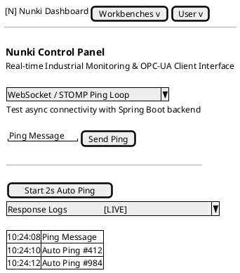
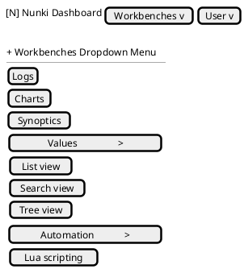
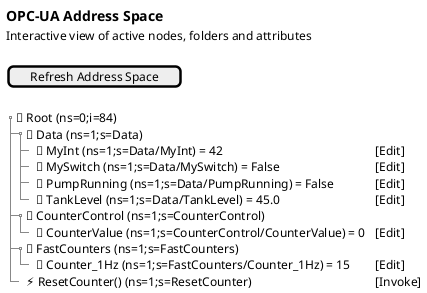
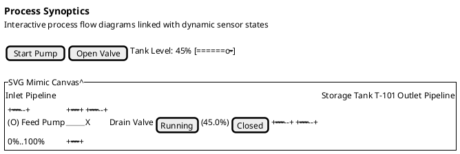
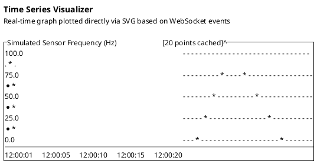

# Svelte 5 Frontend Component Wireframes

This document outlines the visual structure, layout, and appearance of the key components making up the **Nunki Control Panel** Svelte 5 frontend interface. It transposes the actual Svelte components into PlantUML Salt wireframe diagrams to illustrate how the user interface is organized.

---

## 1. Executive Summary & Design System

The Nunki Dashboard is designed as a premium, modern industrial human-machine interface (HMI). Based on the styling definitions in [app.css](file:///home/vortigern/git/nunki/src/main/frontend/src/app.css), it implements a **dark-mode glassmorphic theme** featuring:
- **Curated slate-indigo color palette** (with violet/neon accents).
- **Semantically organized components** mapping directly to standard OPC-UA client operations.
- **Fine-grained Svelte 5 Runes reactivity** (`$state`, `$derived`, `$effect`) for instant telemetry updates.
- **SVG-based dynamic visuals** including real-time graphs and live synoptic diagrams.

The visual interface is organized into five main components:
1. [App.svelte](file:///home/vortigern/git/nunki/src/main/frontend/src/App.svelte): The global dashboard shell containing navigation and tab routing.
2. [Navbar.svelte](file:///home/vortigern/git/nunki/src/main/frontend/src/lib/Navbar.svelte): The top header menu with Workbenches and User dropdowns.
3. [OpcUaTreeNode.svelte](file:///home/vortigern/git/nunki/src/main/frontend/src/lib/OpcUaTreeNode.svelte): Recursive hierarchical tree viewer of the address space.
4. [SynopticView.svelte](file:///home/vortigern/git/nunki/src/main/frontend/src/lib/SynopticView.svelte): Inline SVG industrial flow mimic simulator.
5. [TimeSeriesChart.svelte](file:///home/vortigern/git/nunki/src/main/frontend/src/lib/TimeSeriesChart.svelte): Pure SVG data trend line chart.

---

## 2. Dashboard Shell & Home View (`App.svelte`)

### Visual Appearance & Structure
The [App.svelte](file:///home/vortigern/git/nunki/src/main/frontend/src/App.svelte) component acts as the main viewport coordinator. When the **Home (Logs)** tab is active, the interface divides the main panel into a two-column grid layout under a dashboard header:
- **Left Column**: The WebSocket/STOMP connection card, offering manual ping dispatch inputs and a button to toggle automated 2-second background pings.
- **Right Column**: The response log console, displaying live pongs from the backend with a pulsing `LIVE` badge and chronological timestamps.

### Wireframe Diagram

---

## 3. Navigation Header & Submenus (`Navbar.svelte`)

### Visual Appearance & Structure
The [Navbar.svelte](file:///home/vortigern/git/nunki/src/main/frontend/src/lib/Navbar.svelte) renders a sticky top navigation header bar (56px high) with a custom violet brand logo. 
- **Workbenches Dropdown**: Expands to show main options (Logs, Charts, Synoptics) and two expandable submenus (**Values** and **Automation**) which indent child items like List view, Search view, Tree view, and Lua scripting.
- **User Dropdown**: Contains login, logout, and profile triggers.
- **Outside-Click Detection**: Closes menus automatically if a click is detected outside the navigation container.

### Wireframe Diagram

---

## 4. OPC-UA Address Space Navigator (`OpcUaTreeNode.svelte`)

### Visual Appearance & Structure
The [OpcUaTreeNode.svelte](file:///home/vortigern/git/nunki/src/main/frontend/src/lib/OpcUaTreeNode.svelte) component renders nodes recursively. The list elements flash momentarily in green upon receiving live value updates over the WebSocket channel.
- **Objects**: Render as folder icons with a toggle chevron. Collapsing folders hides child nodes.
- **Variables**: Render as integer symbols (`🔢`), displaying the name, current value, nodeId, and an inline `[Edit]` button to write new values.
- **Methods**: Render as lightning symbols (`⚡`), displaying the name, nodeId, and an `[Invoke]` button, which prints success/failure status badges.

### Wireframe Diagram

---

## 5. Industrial Mimic Synoptic Diagram (`SynopticView.svelte`)

### Visual Appearance & Structure
The [SynopticView.svelte](file:///home/vortigern/git/nunki/src/main/frontend/src/lib/SynopticView.svelte) visualizes a simulated water circulation system using vector graphics. 
- **Feed Pump**: Represented by a circle and cross impeller blades. When active, the status indicator turns green, and the impeller blades spin.
- **Pipeline Network**: Drawn as thick lines. Active fluid flow is animated by shifting dashed stroke overlays towards the storage tank.
- **Storage Tank T-101**: Models a metallic container. Water content scales vertically proportional to the live level state with white gridline tags.
- **Drain Valve**: Renders as a standard hourglass valve. Clicking or pressing Space/Enter toggles its state (Open = Green, Closed = Red).

### Wireframe Diagram

---

## 6. Real-Time Telemetry Trend Chart (`TimeSeriesChart.svelte`)

### Visual Appearance & Structure
The [TimeSeriesChart.svelte](file:///home/vortigern/git/nunki/src/main/frontend/src/lib/TimeSeriesChart.svelte) renders telemetry trends using inline SVG coordinates scaled directly via linear interpolation. 
- **Telemetry Line**: Drawn with a smooth curves path overlaid with a fading neon glow drop-shadow.
- **Grid Lines**: Horizontal dashed guides showing values intervals.
- **Interactivity**: Circular markers highlight individual data points. Hovering over a dot enlarges its radius.
- **Responsiveness**: Resizes dynamically based on parent container boundaries.

### Wireframe Diagram

---

## 7. Associated Requirements & Tasks Reference

To maintain architectural traceability in accordance with Quality Standard [CS-0010](file:///home/vortigern/git/nunki/doc/docs/architecture/CS-0010.md), the components and their structures map directly to the following specifications:

| Requirement / Task | Title / Description | Mapped Component |
|---|---|---|
| **REQ-00014** | WebSocket / STOMP Async Exchanges | `App.svelte`, `websocket.svelte.ts` |
| **REQ-00021** | Display dynamic SVG diagrams and synoptics | `SynopticView.svelte` |
| **REQ-00022** | Display graph of time series | `TimeSeriesChart.svelte` |
| **REQ-00025** | Support for authentication interface | `App.svelte`, `Navbar.svelte` |
| **REQ-00026** | Offline build support / clean navigation | `Navbar.svelte` |
| **TSK-00030.1** | Create Navbar Component | `Navbar.svelte` |
| **TSK-00031.1** | Integrate Navbar in App | `App.svelte` |
| **TSK-00024.1** | Premium Styling Redesign | All UI Components |
